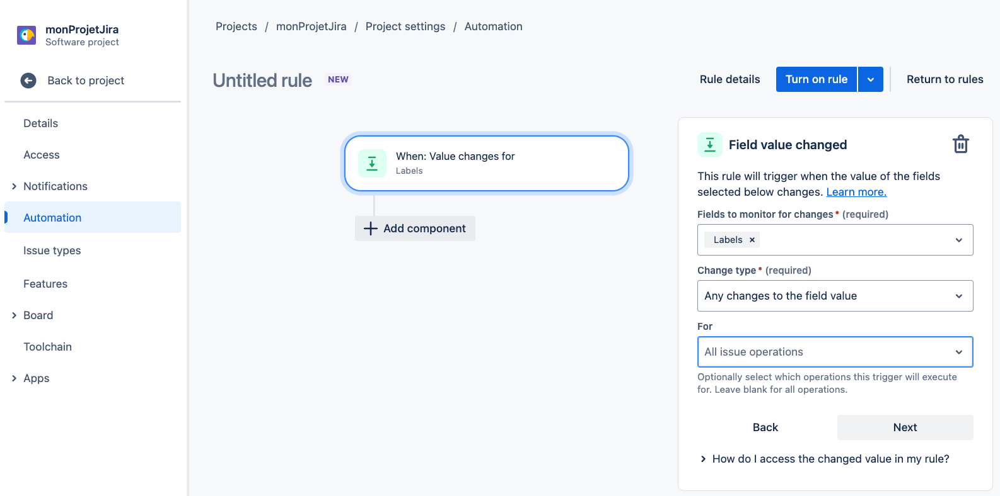

# Présentation des workflows
  Cette documentation décrit le fonctionnement des trois workflows GitHubActions présents dans ce projet :
- .github/workflows/updateMilestone.yml
- .github/workflows/createMilestone.yml
- .github/workflows/closeMilestone.yml

## UpdateMilestone.yml

Une (ou plusieurs) pull request sont associées à un ticket Jira. La version du ticket Jira et le milestone de la PR doivent correspondre. Par exemple si la version du ticket Jira est API-V0.0.2, alors la milestone de la PR sera v0.0.2. Le but de ce workflow est de mettre à jour automatiquement la milestone si la version change.


Fonctionnement : lorsqu'on modifie la version d'un ticket Jira, une automation Jira déclenche le workflow GitHub Action updateMilestone via un appel http.

## CreateMilestone.yml
Un milestone GitHub est associé à une version Jira. Par exemple, si la version API-V0.0.2 est créée dans Jira, alors la milestone v0.0.2 doit aussi être créée dans GitHub. Le but de ce workflow faire cette création automatiquement.

Fonctionnement : lorsqu'une version Jira est créée, une automation Jira déclenche le workflow GitHub Action createMilestone via un appel http.

## CloseMilestone.yml
Un milestone GitHub est associé à une version Jira. Par exemple, si la version API-V0.0.2 est supprimée dans Jira, alors la milestone v0.0.2 doit aussi être supprimée dans GitHub. Le but de ce workflow faire cette création automatiquement.

Fonctionnement : lorsqu'une version Jira est créée, une automation Jira déclenche le workflow GitHub Action createMilestone via un appel http.


---
# Création d'un workflow

## 1 - Créer un workflow GitHub
Créer un workflow GitHub Actions et le placer dans le dossier `.github/workflows/`.
Le merger sur master pour qu'il apparaisse dans l'onglet "Actions"

## 2- Le tester manuellement :
Dans l'onglet "Actions", sélectionner le workflow à gauche puis cliquer sur "Run workflow" à droite :


## 3- Récupérer l'id du workflow
Pour créer le Jira Automation, il faut d'abord récupèrer l'id du workflow : dans un terminal, faire cet appel Curl (après avoir remplacé le token github par le vôtre) :

```bash 
curl -L -H "Accept: application/vnd.github+json"  -H "Authorization: Bearer <token>" -H "X-GitHub-Api-Version: 2022-11-28" https://api.github.com/repos/Next-Interactive/devadmin-scripts/actions/workflows
```

Vous récupèrerez la liste des workflows correspondants, à partir de laquelle vous pourrez extraire l'id du workflow : 
```JSON
{
  "total_count": 1,
  "workflows": [
    {
      "id": 123, <--- ceci
   ...
}
```


## 4- Créer l'automation Jira

Dans un projet Jira, aller sur 'Automation' puis 'create rule':
https://rmcbfm.atlassian.net/jira/software/projects/CE/settings/automation#/rule/new/__NEW__TRIGGER 

### Créer une 1ère étape
Par exemple, choisir "Field Value changed" et remplir les champs selon vos besoin :




### Créer une 2ème étape
Par exemple, cliquer sur 'add component' et remplissez le champs suivants en fonction de vos besoin : 

| Field name        | Value                       |
| ------------------|:---------------------------:|
| Web request URL   | https://api.github.com/repos/Next-Interactive/devadmin-scripts/actions/workflows/<id du workflow récupèré juste avant (123)>/dispatches |
| HTTP method       | POST           |
| Web request body  | Custom data           |
| Custom data       |  {"ref": "master","inputs": {"pull_request_title_prefix": "{{issue.key}}","version": "{{issue.labels}}"}} |

> [!NOTE]
> L'API Jira peut être utilisée pour récupérer les noms des fields : 
> https://maatthieu.atlassian.net/rest/api/2/issue/KAN-1?expand=names

Dans la partie headers:
| Field name           | Value                       |
| -------------------- |:---------------------------:|
| Accept               | application/vnd.github+json |
| Authorization        | Bearer ghp_Az4...           |
| X-GitHub-Api-Version | 2022-11-28                  |


 
Cliquer sur suivant, activer la rules et donner lui un nom.

> [!TIP]
> Astuce : Pour executer un workflow github actions avec un appel Curl :
>```
> curl -L -X POST -H "Accept: application/vnd.github+json" -H > "Authorization: Bearer <your_token>" -H "X-GitHub-Api-Version: > 2022-11-28" https://api.github.com/repos/maatth/GitHubActionsTriggers/> actions/workflows/123351232/dispatches -d '{"ref":"main","inputs":{"pull_request_title_prefix":"SCRUM-1","version":"API-V0.0.2"}}'
> ```

Ressources : 
- https://github.com/Mudlet/Mudlet/blob/development/.github/workflows/tag-pull-requests.yml
- https://github.com/orgs/community/discussions/25724
- https://github.com/n8ebel/GitHubActionsAutomationSandbox/blob/main/.github/workflows/workflow_dispatch_example.yml
- https://docs.github.com/en/rest/issues/milestones?apiVersion=2022-11-28
- https://docs.github.com/en/rest?apiVersion=2022-11-28
- https://goobar.dev/manually-trigger-a-github-actions-workflow/